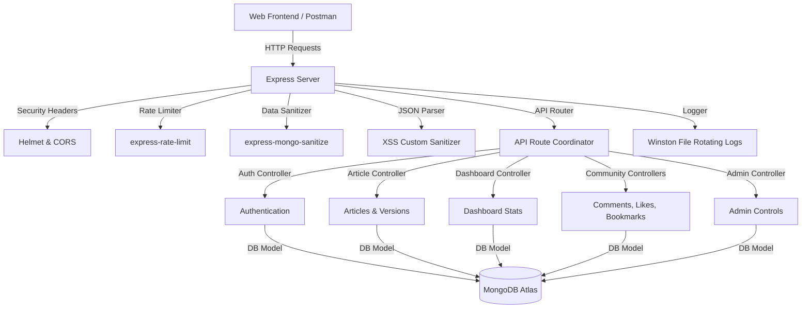

# BlogAuth — Production Ready Digital Journal Stack

BlogAuth is a premium, feature-complete web application and digital journal backend designed for secure authorship, interactive comments, bookmarks, and comprehensive dashboard analytics.

---

## Technical Architecture

BlogAuth follows a decoupled MVC pattern on the backend, utilizing Node.js, Express, and Mongoose to serve an API.



---

## Tech Stack
- **Backend Framework**: Node.js & Express
- **Database**: MongoDB & Mongoose
- **API Documentation**: Swagger / OpenAPI
- **Logging**: Winston Daily Rotating Logger
- **Security**: Helmet, CORS, Express-Rate-Limit, Express-Mongo-Sanitize, Secure Cookies
- **Containerization**: Docker & Docker Compose
- **Testing Suite**: Jest & Supertest

---

## Folder Structure
```
auth_blog/
├── backend/
│   ├── config/             # DB, Swagger configurations
│   ├── controllers/        # Business logic controllers
│   ├── logs/               # Application rotated logs
│   ├── middleware/         # Security & error middleware
│   ├── models/             # Mongoose schemas
│   ├── routes/             # API Router definitions
│   ├── scripts/            # Sandbox DB Seed scripts
│   ├── services/           # Underlying service classes
│   ├── tests/              # Jest integration tests
│   ├── app.js              # Express app definitions
│   ├── server.js           # Server startup coordinator
│   └── Dockerfile          # Multi-stage production build dockerfile
├── css/                    # Frontend styles
├── js/                     # Frontend client logic
├── docker-compose.yml      # Multi-container orchestrator
└── README.md               # Product manual
```

---

## Installation & Local Execution

### Prerequisites
- Node.js >= 18.0.0
- MongoDB (Local instance or Cloud Atlas cluster URL)

### Local Configuration
Create a `.env` file under `backend/` mirroring the `.env.example`:
```env
PORT=5000
NODE_ENV=development
MONGO_URI=your-mongodb-connection-string
JWT_SECRET=your-secure-jwt-key
JWT_EXPIRES_IN=7d
CORS_ORIGIN=*
```

### Running Locally
1. Install dependencies:
   ```bash
   cd backend
   npm install
   ```
2. Populate the database sandbox data:
   ```bash
   npm run seed
   ```
3. Start the dev server:
   ```bash
   npm run dev
   ```

---

## Running with Docker

Orchestrate the entire application stack including MongoDB and persistent volumes in a single command:
```bash
docker compose up --build
```
This maps the backend server to `http://localhost:5000` and initializes MongoDB container on port `27017` with a named data volume.

---

## Testing & Quality Coverage

Run the integration suite containing tests for Auth, Articles, Comments, Bookmarks, and Admin modules:
```bash
cd backend
npm test
```
Generate an HTML coverage report:
```bash
npm run test:coverage
```

---

## API & Postman Integration

### Interactive Swagger Docs
Open your browser and navigate to:
- `http://localhost:5000/api/docs` or `http://localhost:5000/api/v1/docs`

### Postman Collection
Import the ready-made collection to test all endpoints:
- [BlogAuth.postman_collection.json](file:///c:/Users/Shourya%20Upadhyay/OneDrive/Documents/ALL%20CODES/I2_P1_/auth_blog/backend/BlogAuth.postman_collection.json)

---

## License
MIT License.